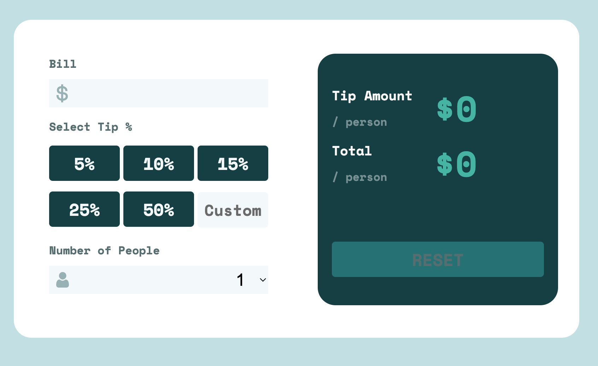
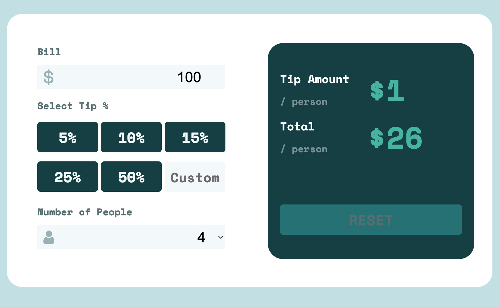

# Frontend Mentor - Tip calculator app solution

This is a solution to the [Tip calculator app challenge on Frontend Mentor](https://www.frontendmentor.io/challenges/tip-calculator-app-ugJNGbJUX). Frontend Mentor challenges help you improve your coding skills by building realistic projects.

## Table of contents

- [Overview](#overview)
  - [The challenge](#the-challenge)
  - [Screenshot](#screenshot)
  - [Links](#links)
- [My process](#my-process)
  - [Built with](#built-with)
  - [What I learned](#what-i-learned)
  - [Continued development](#continued-development)
  - [Useful resources](#useful-resources)
- [Author](#author)
- [Acknowledgments](#acknowledgments)

**Note: Delete this note and update the table of contents based on what sections you keep.**

## Overview

### The challenge

Users should be able to:

- See hover states for all interactive elements on the page
- Calculate the correct tip and total cost of the bill per person

### Screenshot

### Links

- Solution URL: [Add solution URL here](https://www.frontendmentor.io/solutions/react-app-tip-calculator-vHF-RIjfWS)
- Live Site URL: [Add live site URL here](https://tip-calculator-react-gilt.vercel.app/)

## My process

### Built with

- Semantic HTML5 markup
- CSS custom properties
- [React](https://reactjs.org/) - JS library
- [Next.js](https://nextjs.org/) - React framework
- [Styled Components](https://styled-components.com/) - For styles
- [Google Fonts](https://fonts.google.com/)
- [Git](https://git-scm.com/) \* Used for version control.
- [GitHub](https://github.com/) \* Used to store the code once pushed from Git.

### What I learned

This is the first project I've built using the React Framework. It was a steep learning curve to unterstand the layout of the JSX syntax "state" and the functionality of the controled elements. Although it was a small project I feel i learnt alot.

### Continued development

Continue learning React on Udemy. Moving onto a bigger project

### Useful resources

- [w3schools](https://www.w3schools.com/) - A great webpage for someone beginning their journey with code.
- [stackoverflow](https://stackoverflow.com/) - Another very useful site.

## Author

- Frontend Mentor - [@J-R77-stack](https://www.frontendmentor.io/profile/J-R77-stack)
- Linkedin - [@johnny-ramsay](https://www.linkedin.com/in/johnny-ramsay-developer/)
